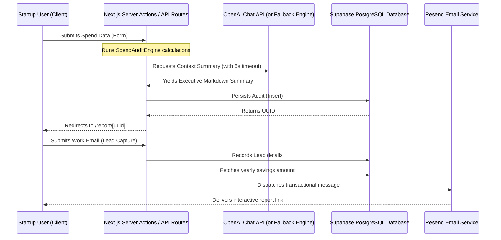

# System Architecture — TokenSpend.ai

A detailed overview of the system boundaries, data flow, API route architecture, and security boundaries.

### 1. Data Flow Diagram


### 2. API Endpoints
* **`POST /api/audit`**: Enforces JSON validation. Resolves within the standard API server route. Returns calculated breakdown and persists report.
* **`POST /api/lead`**: Captures user emails, company names, and consent checkboxes. Enforces email regex formatting.
* **`GET /api/og`**: Edge-runtime dynamic Open Graph image service. Converts React/JSX components directly to dynamic PNG files containing custom savings integers.

### 3. Database Security & Policies
To ensure startup audit privacy, we implement the following Postgres security model:
* **Row Level Security (RLS):** Enabled on the `audits` and `leads` tables.
* **Read Policies:** Audits can be queried publicly using their unique, cryptographic UUID string (`id` matches query param).
* **Write Policies:** Clients can insert new records into `audits` and `leads` anonymously, but cannot run general updates, deletes, or SELECT scans without credentials.
```sql
-- Enable RLS
ALTER TABLE audits ENABLE ROW LEVEL SECURITY;
ALTER TABLE leads ENABLE ROW LEVEL SECURITY;

-- Anonymous Select by specific ID (Public Report View)
CREATE POLICY "Allow public select by id" ON audits
  FOR SELECT USING (is_public = true);

-- Anonymous Insert
CREATE POLICY "Allow public insert" ON audits
  FOR INSERT WITH CHECK (true);

-- Lead Insert
CREATE POLICY "Allow public lead insert" ON leads
  FOR INSERT WITH CHECK (true);
```
